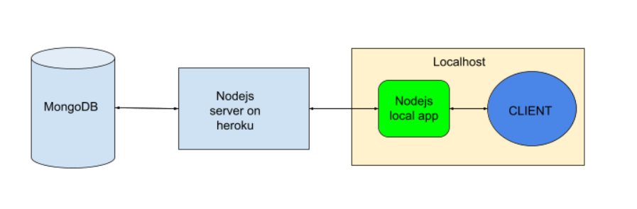

# League-runes

Node.js application that automatically sets the runes with the highest winrate after locking in a champion in LoL.

All data is scraped from https://www.metasrc.com/, and saved to local storage for fast access. Server communicates through League's internal client

To run, use npm start at project directory and a browser tab at http://localhost:3000 will open to communicate with the server and show errors.

## Plan

## ToDo
- [ ] Create MongoDB database, User and Champion models in Node
- [ ] Add user Authentication
- [ ] Separate data collection and handling user connection to different Node server
- [ ] Host server to Heroku
